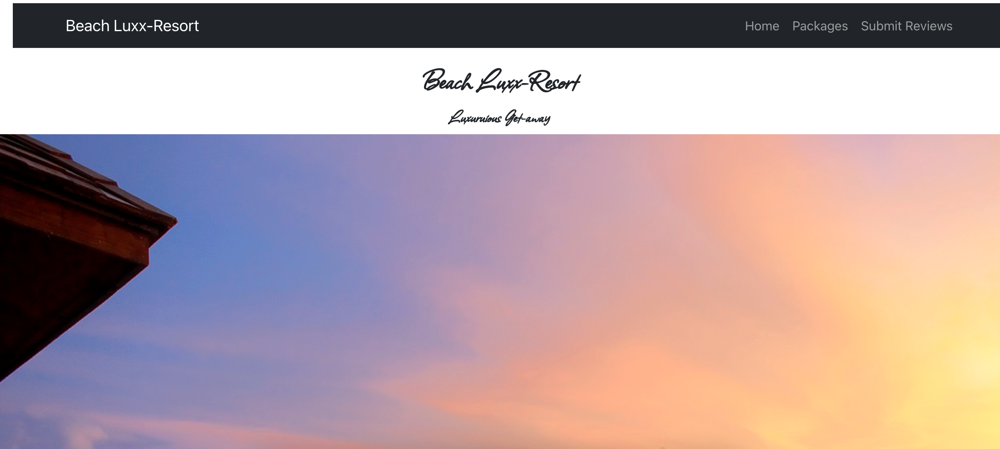
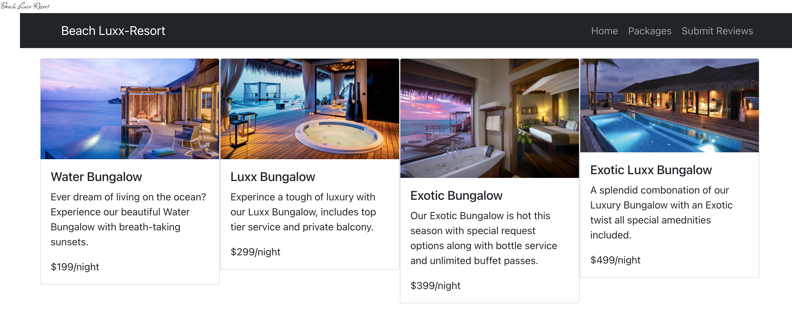
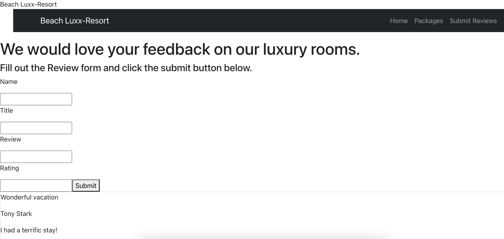

># ***Beach-LuxxResort***

#### *By: Janay Anguiano*

#### 08/29/2021

| [GitHub](https://github.com/Jangui92) | [LinkedIn](https://www.linkedin.com/in/janay-anguiano-778717215/) |

>## *Getting Started*
If you would like to take a look at ***Beach-LuxxResort's*** development process in Trello Board, please Click [Here](https://trello.com/b/yx2LuSLt/beach-resort). [Beach-LuxxResort] is deployed on Heroku, take a look.

> ## *Technologies used*
- Mongoose
- Express
- React
- Node
- Heroku

>## *Details* 
Imagine taking a trip where everything is dedicated to making sure that you are relaxed. ***Beach-Luxx Resort*** is a website for those looking to get-away and pretend the worries of the world don't exist. We believe that the best way to get-away successfully is in ***Luxx***ury. 
### Client Details
Upon opening the webpage, the client is greeted with a tempting visual of clear blue water and the resort sitting on a white sandy beach. The home and welcome page provides details of our most popular accomodations to visitors such as: Wifi, free parking, complimentary breakfast, early checkout, late checkout and our best rates for that season.

### Development Process
The Navigation bar will be holding the home and about page as well as experience, packages and review page. I will be utilizing ***Flexbox*** in all my Pages as they have displays. Review will have a ***Schema*** which will both display on the front-end. ***Post*** ***Get*** and ***Delete*** operations will be used in Review & comments page. All pages will be navigated using ***React Router***.

### Structured Outline
####
**Pages**
- Home & About page
- Submit Review
- Packages 

**Components**

- Header (Navbar)
- SubmitReviewCards
- Package Cards

**Models**
- Review (get, post, delete)
- Packages (get)

>## *Screenshots*

>## *Credits*
[Google Font & Images](Google.com)

>## *Future Updates*
- [ ] Add deployment link
- [x] Add credits
- [x] Add final product screenshots